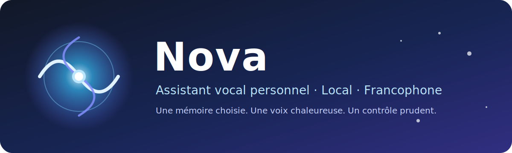
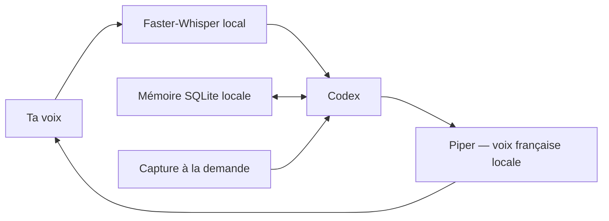

<div align="center">
  

  # Nova

  **Un assistant vocal personnel, francophone et local pour Windows, propulsé par Codex.**

  [](https://www.microsoft.com/windows)
  [](https://www.python.org/)
  [](https://developers.openai.com/codex/)
  [](LICENSE)
</div>

Nova est une première version volontairement prudente d’un « deuxième cerveau » vocal. Elle
écoute localement, parle avec une voix française hors ligne, conserve uniquement les souvenirs
que tu approuves et peut expliquer ce qui apparaît à l’écran.

> [!IMPORTANT]
> Nova utilise actuellement Codex en **lecture seule**. Elle peut discuter, mémoriser et analyser
> une capture, mais ne modifie pas encore ton ordinateur.

## Fonctionnalités

- 🎙️ reconnaissance vocale française locale avec Faster-Whisper ;
- 🔊 voix française Siwis avec Piper, sans service vocal externe ;
- 🧠 conversations alimentées par une session ChatGPT/Codex ;
- 👁️ analyse ponctuelle de l’écran avec `/screen` ;
- 💾 mémoire locale SQLite consultable et supprimable ;
- 🛡️ exécution Codex éphémère dans le bac à sable `read-only` ;
- 🔑 aucune clé API OpenAI ou OpenRouter nécessaire.

## Architecture



Le son entrant, la synthèse vocale et la mémoire restent sur le PC. Les messages envoyés à
Codex — et les captures demandées avec `/screen` — suivent les règles de traitement de ta
session ChatGPT/Codex.

## Prérequis

- Windows 10 ou 11 ;
- Python 3.11 ou plus récent ;
- [Codex CLI](https://developers.openai.com/codex/cli/) ;
- un compte ChatGPT donnant accès à Codex ;
- un microphone et une sortie audio.

Connecte d’abord le CLI :

```powershell
codex.cmd login
codex.cmd login status
```

Le statut attendu est `Logged in using ChatGPT`.

## Installation

1. Télécharge ou clone ce dépôt.
2. Double-clique une fois sur `setup.cmd`.
3. Double-clique ensuite sur `start.cmd`.
4. Écris un message, ou appuie sur Entrée pour parler.

L’installation crée un environnement `.venv` privé au projet et télécharge les modèles locaux.
Ces fichiers volumineux ne sont pas versionnés.

## Commandes

| Commande | Fonction |
|---|---|
| Entrée vide | Écouter le microphone |
| `/screen [question]` | Capturer puis expliquer l’écran |
| `/remember TEXTE` | Enregistrer un souvenir approuvé |
| `/memories` | Afficher les souvenirs |
| `/forget ID` | Supprimer un souvenir |
| `/clear` | Effacer l’historique de conversation |
| `/mute` / `/unmute` | Désactiver ou réactiver la voix |
| `/quit` | Fermer Nova |

Exemple :

```text
/remember Je préfère des explications courtes.
/screen Que signifie cette fenêtre d’erreur ?
```

## Personnalisation

- `config.json` : nom, vitesse de parole, seuil du microphone et taille de l’historique ;
- `persona.md` : caractère, ton et principes de Nova.

Une valeur `piper_speed` plus élevée ralentit la voix.

## Vie privée et sécurité

- Les souvenirs et l’historique sont enregistrés dans `data/assistant.db`.
- `data/`, `models/`, `.venv/` et `workspace/` sont exclus de Git.
- Une capture est créée uniquement après `/screen`, utilisée pour une réponse puis supprimée.
- Codex est lancé dans une session éphémère avec le bac à sable en lecture seule.
- Nova ne lit ni ne copie les jetons présents dans les fichiers d’authentification Codex.

Ne publie jamais le contenu de `data/` ni une capture contenant des renseignements sensibles.

## Feuille de route

- [x] conversation écrite et vocale ;
- [x] mémoire explicite locale ;
- [x] voix française hors ligne ;
- [x] compréhension de l’écran à la demande ;
- [ ] interface graphique dans la barre des tâches ;
- [ ] mot d’activation optionnel ;
- [ ] mode Action avec confirmations détaillées ;
- [ ] export et édition graphique des souvenirs.

## Développement

```powershell
python -m venv .venv
.\.venv\Scripts\python.exe -m pip install -r requirements.txt
.\.venv\Scripts\python.exe -m py_compile assistant.py
```

Les contributions sont bienvenues. Consulte [CONTRIBUTING.md](CONTRIBUTING.md) avant de proposer
un changement.

## Licence et crédits

Nova est distribuée sous licence [GNU GPL v3](LICENSE). Elle s’appuie notamment sur
[Faster-Whisper](https://github.com/SYSTRAN/faster-whisper),
[Piper](https://github.com/OHF-Voice/piper1-gpl) et la voix
[Siwis](https://huggingface.co/rhasspy/piper-voices/tree/main/fr/fr_FR/siwis/medium).
